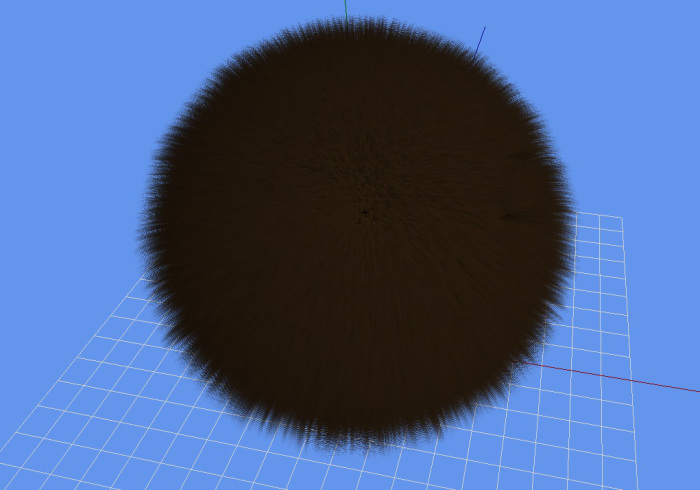
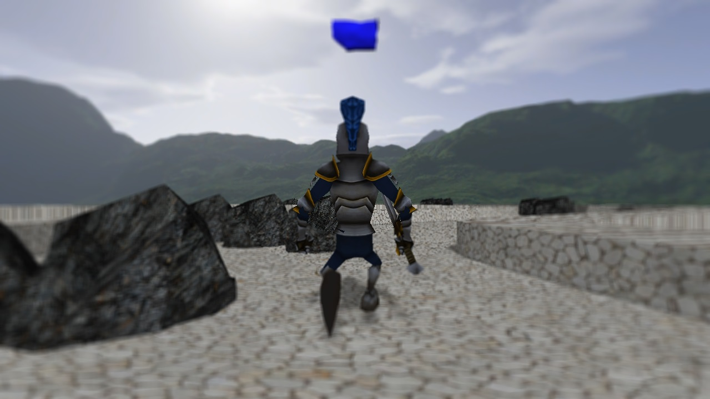

# Implementing Features in a Game Engine

## [Source Snippets](Source)

## Contents
[Fur](#fur-with-clutter-force-and-a-lot-of-parameters)  
[PhysX](#collisionstriggers-with-physx-from-nvidia)  
[Model with Material, Shadows and Animations](#model-with-material-shadows-and-animations)  
[Post Processing](#post-processing)  

## Fur with Clutter, Force and a lot of parameters

## Collisions/Triggers with PhysX from Nvidia

## Model with Material, Shadows and Animations

## Post Processing
> [Source](/Source/RadialBlur.fx) of the radial blur shader:

