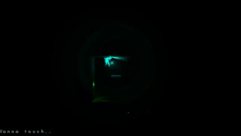

# Forgotten
A relaxing 2D platformer with simplistic artstyle and gameplay.  

 

**What I Did:**
Prototyping, Camera and Player movement, Level interaction, Level Creation and UI.  

**How:**
Made in Unity, using C# for scripting and TortoiseHg for source control.
Take a look at the script for the player behaviour [here](https://github.com/JonasDeM/JonasDeM.github.io/blob/master/Forgotten/PlayerScript.cs).  

**Who:**
Team of 2 artists and 2 programmers. We made this prototype in 3 weeks.  

**Video:**  
>In this video you can watch 10 minutes of gameplay. Feel free to skip through the video to get a feel of how the game plays.

<iframe width="560" height="315" src="https://www.youtube.com/embed/OoIFFn0YiDs" frameborder="0" allow="autoplay; encrypted-media" allowfullscreen="allowfullscreen"> </iframe>
