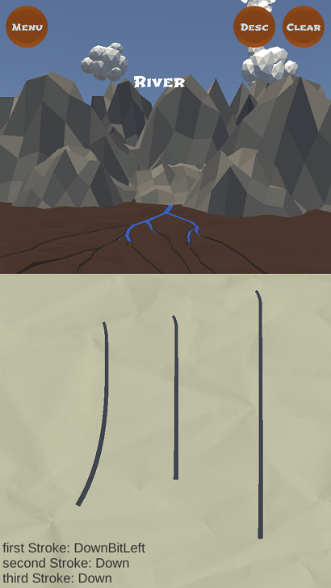

# KanjiPrototype
**What:**
A first prototype of a game that aims to teach people how to write Kanji in a more relaxing manner. It's for mobile.  

**How:**
Made in Unity. Scripts and Stand-alone tools in C#.

**Who:**
Coding was mostly on my own, with some help from another developer. Assets are from 2 artists.  

**Features**:
* Any Kanji from the KanjiVG Library can be implemented in the game.
* Instant feedback on if you’re correct or not.
* When you are correct a scene in the background progresses towards an end goal.  

**What I Did:**
* Created a tool to convert .svg data into my own custom recognition data
* Kanji recognition inside Unity
* Menus, UI, Sound
* Gameplay  

**Screenshots:**  

  

**Acknowledgements:**
[KanjiVG Library](http://kanjivg.tagaini.net/)